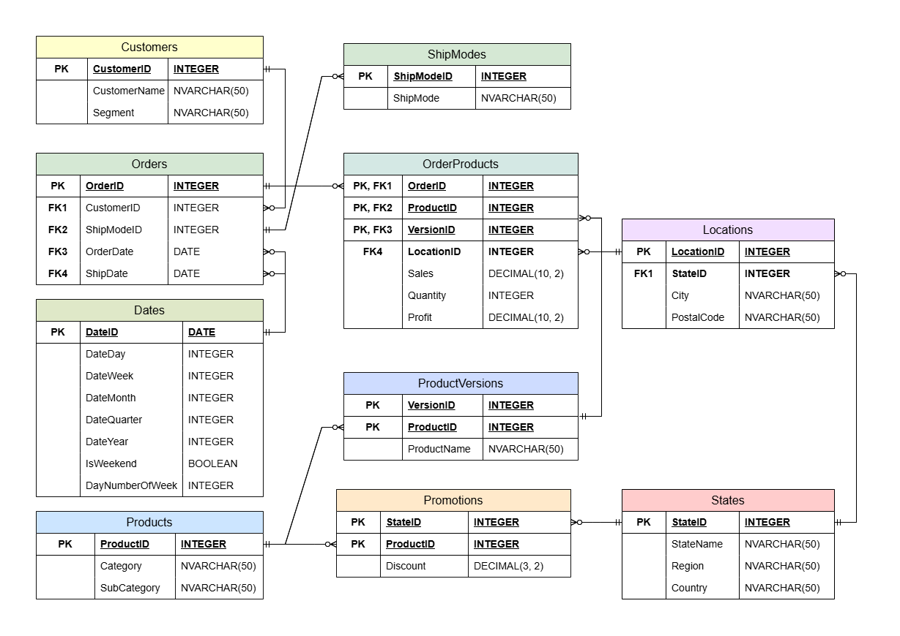

# Superstore Sales (Data Engineering Project)

## О проекте

Проект создан с целью учебной практики по созданию нормализованной базы данных для анализа продаж.

**Задачи проекта**
1. Провести очистку и подготовку данных с помощью Python
2. Спроектировать структуру БД в соответствии с 3НФ
3. Создать БД и таблицы в MS SQL Server
4. Загрузить обработанные данные через Python в созданную БД

## Используемые инструменты
- **Python**: pandas, numpy, matplotlib, pyodbc, sqlalchemy
- **SQL**: MS SQL Server
- **Визуализация**: draw.io (ER-диаграмма)

## Результат
Готовая база данных в 3НФ с обработанными данными для анализа и построения витрин.

**Ноутбук с анализом и обработкой данных**
[superstore-data-processing.ipynb](notebooks/superstore-data-processing.ipynb)

## Исходные данные

Ссылка на датасет Superstore: https://www.kaggle.com/datasets/vivek468/superstore-dataset-final

Количество записей: 9994

**Метаданные**
- Row ID => Уникальный ID для каждой записи
- Order ID => Уникальный ID заказа для каждого покупателя
- Order Date => Дата заказа
- Ship Date => Дата доставки
- Ship Mode=> Тип доставки
- Customer ID => Уникальный ID для покупателя
- Customer Name => Имя покупателя
- Segment => Сегмент покупателя
- Country => Страна местонахождения покупателя
- City => Город местонахождения покупателя
- State => Штат местонахождения покупателя
- Postal Code => Почтовый индекс покупателя
- Region => Регион, где находится покупатель
- Product ID => Уникальный ID продукта
- Category => Категория заказанного продукта
- Sub-Category => Подкатегория заказанного продукта
- Product Name => Название продукта
- Sales => Продажи продукта
- Quantity => Количество продукта в заказе
- Discount => Предоставленная скидка
- Profit => Прибыль/убыток от заказа

## Этапы проекта

### 1. Анализ и очистка данных (Python)
- Определение кодировки файла с датасетом, импорт данных
- Просмотр статистики по датасету, проверка и удаление дубликатов, преобразование данных и названий в нужный формат
- Разделение данных на датафреймы для загрузки в БД с проверкой на потери записей
- Создание дополнительных столбцов для интерпретации данных (для ключей) и справочной информации

**Итог:** готовые датафреймы для загрузки в БД

### 2. Проектирование базы данных
- Нормализация до 3NF
- Выделение сущностей: Customers, Products, Orders, Locations, Dates и др.
- Создание ER-диаграммы в Draw.io

**Итоговая структура:**

- **Справочные таблицы:** Dates, Products, ProductVersions, States, Locations, Promotions, ShipModes
- **Фактические таблицы:** Customers, Orders, OrderProducts

### 3. Создание БД в MS SQL Server
**SQL-скрипт для создания БД**
[SQL-запрос для создания БД Superstore](sql-scripts/SQLQueryCreateSuperstore.sql)

**SQL-скрипт для создания таблиц со связями и ограничениями**
[SQL-запрос для создания таблиц](sql-scripts/SQLQueryCreateSuperstoreTables.sql)

### 4. Загрузка данных
- Загрузка данных осуществлена через [superstore-data-processing.ipynb](notebooks/superstore-data-processing.ipynb)
- Для учета зависимостей последовательно загружались справочные и фактические таблицы

## Планы по развитию проекта
- Построить витрины данных и создать дашборд в Power BI/ Tableau
- Написать SQL-запросы для анализа, в т.ч. с оконными функциями
- Составить python-скрипты для автоматизации обработки и загрузки данных
- Добавить обработку ошибок при импорте, обработке данных и загрузке в БД
